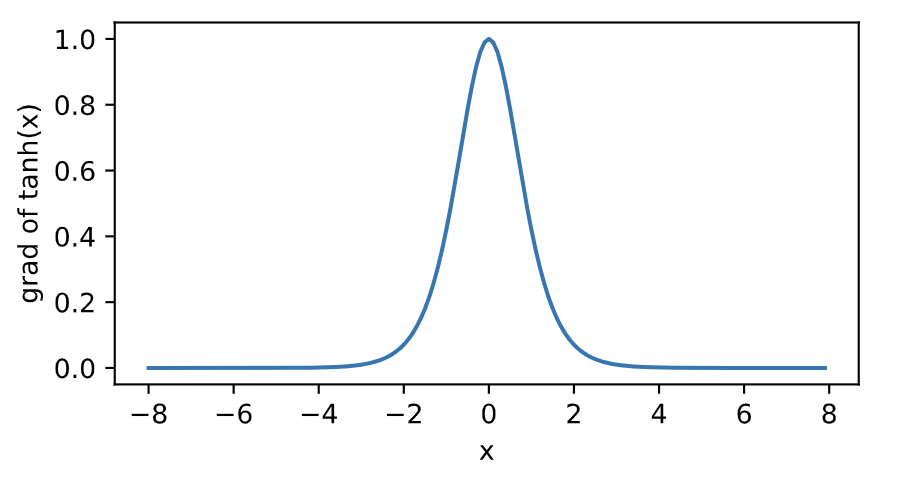
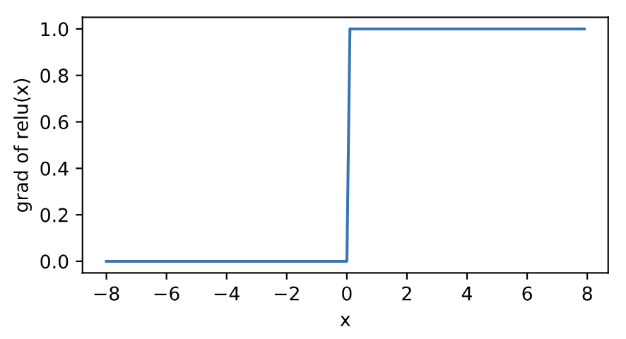
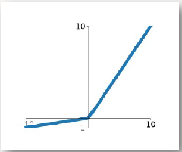
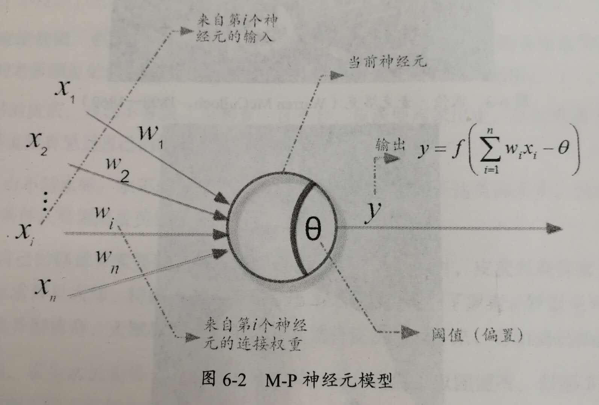
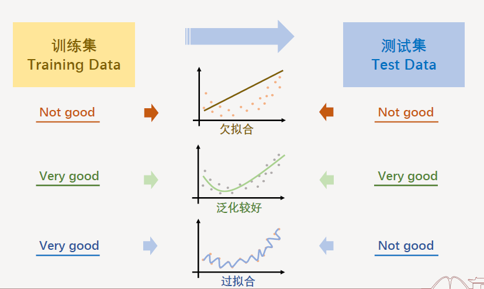
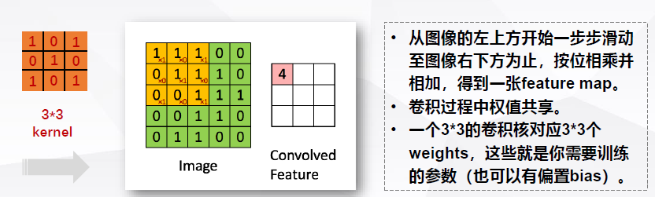
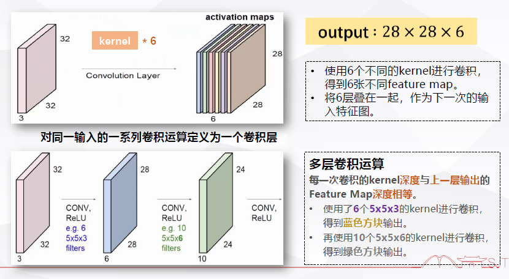

# Pytorch+DL学习笔记

> 尤尼克恩 UNIkeEN
>
> 本笔记基于开源教学项目《Dive-into-DL-PyTorch》、SJTU-AI001课程及自学中的扩展内容

## 基本知识与简单DNN网络

### 线性回归模型

即线性拟合，假设线性回归假设输出与各个输入之间是线性关系：
$$
\hat{y} = x_1 w_1 + x_2 w_2 + b
$$

#### 平方loss函数

在模型训练中，我们需要衡量价格预测值与真实值之间的误差。通常我们会选取一个非负数作为误差，且数值越小表示误差越小。一个常用的选择是平方函数。它在评估索引为 $i$ 的样本误差的表达式为

$$\ell^{(i)}(w_1, w_2, b) = \frac{1}{2} \left(\hat{y}^{(i)} - y^{(i)}\right)^2$$

其中常数 $\frac 1 2$ 使对平方项求导后的常数系数为1，这样在形式上稍微简单一些。这里使用的平方误差函数也称为平方损失（square loss）。

通常，我们用训练数据集中所有样本误差的平均来衡量模型预测的质量，即

$$
\ell(w_1, w_2, b) =\frac{1}{n} \sum_{i=1}^n \ell^{(i)}(w_1, w_2, b) =\frac{1}{n} \sum_{i=1}^n \frac{1}{2}\left(x_1^{(i)} w_1 + x_2^{(i)} w_2 + b - y^{(i)}\right)^2
$$

在模型训练中，我们希望找出一组模型参数，记为 $w_1^*, w_2^*, b^*$，来使训练样本平均损失最小：

$$
w_1^*, w_2^*, b^* = \underset{w_1, w_2, b}{\arg\min} \ell(w_1, w_2, b)
$$

```python
def squared_loss(y_hat, y): 
    return (y_hat - y.view(y_hat.size())) ** 2 / 2
```

#### loss函数反向传播 与 小批量随机梯度下降优化（SGD)

当模型和损失函数形式较为简单时，上面的误差最小化问题的解可以直接用公式表达出来。这类解叫作解析解。本节使用的线性回归和平方误差刚好属于这个范畴。然而，大多数深度学习模型并没有解析解，只能通过优化算法有限次迭代模型参数来尽可能降低损失函数的值。这类解叫作数值解。

在求数值解的优化算法中，小批量随机梯度下降（mini-batch stochastic gradient descent）在深度学习中被广泛使用。它的算法很简单：先选取一组模型参数的初始值，如随机选取；接下来对参数进行多次迭代，使每次迭代都可能降低损失函数的值。在每次迭代中，先随机均匀采样一个由固定数目训练数据样本所组成的小批量（mini-batch）$\mathcal{B}$，然后求小批量中数据样本的平均损失有关模型参数的导数（梯度），最后用此结果与预先设定的一个正数的乘积作为模型参数在本次迭代的减小量。==（对**loss**函数求梯度，loss反向传播的时候，每一个需要更新的参数都会求出来一个对应的梯度）==

> 反向传播指的是计算神经网络参数梯度的方法。总的来说，反向传播依据微积分中的链式法则，沿着从输出层到输入层的顺序，依次计算并存储目标函数有关神经网络各层的中间变量以及参数的梯度。
>
> **在训练深度学习模型时，正向传播和反向传播之间相互依赖。**
>
> 模型参数初始化后，交替进行正向传播和反向传播，并根据反向传播计算的梯度迭代模型参数。反向传播中使用了正向传播中计算得到的中间变量来避免重复计算，那么这个复用也导致正向传播结束后不能立即释放中间变量内存。这也是训练要比预测占用更多内存的一个重要原因。
>
> 中间变量个数与网络层数线性相关，变量大小、批量大小与输入个数也是线性相关的，它们是导致较深的神经网络使用较大批量训练时更容易超内存的主要原因。

在训练本节讨论的线性回归模型的过程中，模型的每个参数将作如下迭代：

$$
\begin{aligned}
w_1 &\leftarrow w_1 -   \frac{\eta}{|\mathcal{B}|} \sum_{i \in \mathcal{B}} \frac{ \partial \ell^{(i)}(w_1, w_2, b)  }{\partial w_1} = w_1 -   \frac{\eta}{|\mathcal{B}|} \sum_{i \in \mathcal{B}}x_1^{(i)} \left(x_1^{(i)} w_1 + x_2^{(i)} w_2 + b - y^{(i)}\right),\\
w_2 &\leftarrow w_2 -   \frac{\eta}{|\mathcal{B}|} \sum_{i \in \mathcal{B}} \frac{ \partial \ell^{(i)}(w_1, w_2, b)  }{\partial w_2} = w_2 -   \frac{\eta}{|\mathcal{B}|} \sum_{i \in \mathcal{B}}x_2^{(i)} \left(x_1^{(i)} w_1 + x_2^{(i)} w_2 + b - y^{(i)}\right),\\
b &\leftarrow b -   \frac{\eta}{|\mathcal{B}|} \sum_{i \in \mathcal{B}} \frac{ \partial \ell^{(i)}(w_1, w_2, b)  }{\partial b} = b -   \frac{\eta}{|\mathcal{B}|} \sum_{i \in \mathcal{B}}\left(x_1^{(i)} w_1 + x_2^{(i)} w_2 + b - y^{(i)}\right).
\end{aligned}
$$

在上式中，$|\mathcal{B}|$ 代表每个小批量中的样本个数（批量大小，batch size），$\eta$ 称作学习率并取正数。

这里的批量大小和学习率的值是人为设定的，并不是通过模型训练学出的，因此叫作超参数）。我们通常所说的“调参”指的正是调节超参数，例如通过反复试错来找到超参数合适的值。在少数情况下，超参数也可以通过模型训练学出。 

`torch.optim`模块提供小批量随机梯度下降（SGD）

```python
def sgd(params, lr, batch_size): 
    for param in params:
        param.data -= lr * param.grad / batch_size # 注意这里更改param时用的param.data
```

SGD优点：

* 不是对全部数据进行运算，迭代速度大大加快

SGD缺点：

* 单个样本的梯度并非全局最优，优化方向准确度不够
* 不易于并行实现

而原始梯度下降（BDG，最原始的形式。每次迭代时使用所有样本进行梯度更新）实现并行加速、更新方向准确，但在样本数目过大时训练很慢，且容易陷入局部最优

#### 手写实现

==\1_Linear_Regression.ipynb==

```python
import torch
import numpy as np
import random
from matplotlib import pyplot as plt
```

##### 随机生成数据集

```python
num_inputs=3
num_examples=500
real_w=[-6, 3.2, 10.5]  # w1,w2,w3真实值
real_b=1.7  # b真实值

# 生成随机输入，为10000*3矩阵
features=torch.randn(num_examples,num_inputs,dtype=torch.float32)

# 根据真实值生成标签
labels = real_w[0] * features[:,0] 
for i in range(1,num_inputs):
    labels += real_w[i]*features[:,i]
labels += real_b

# 给标签加上噪声
labels+=torch.tensor(np.random.normal(0,0.01,size=labels.size()),dtype=torch.float32)
```

##### 读取数据

```python
def data_iter(batch_size,features,labels):
    num_examples=len(features)
    
    # 生成大小为num_examples的数值列表并打乱，做到顺序随机读取数据
    index=list(range(num_examples)) 
    random.shuffle(index)
    
    for i in range(0, num_examples, batch_size):
        j=torch.LongTensor(index[i:min(i+batch_size,num_examples)]) # 此处LongTensor相当于索引张量
        
        # 使用index_select(dim,index) 在dim维取序号为index的数据
        # yield中断，保证按随即列表全部取完
        yield features.index_select(0,j), labels.index_select(0,j)  
```

##### 初始化模型参数

```python
w=torch.tensor(np.random.normal(0,0.01,(num_inputs,1)),dtype=torch.float32) # 生成3*1矩阵便于乘法
b=torch.zeros(1,dtype=torch.float32)

# 要求梯度追踪
w.requires_grad_(requires_grad=True)
b.requires_grad_(requires_grad=True)
```

##### 定义模型

```python
def net(X,W,b):
    return torch.mm(X , W)+ b
```

##### 定义loss函数

```python
def loss(y,real_y):
    return (y-real_y.view(y.size()))**2/2
```

##### 定义sgd函数

```python
def sgd(params, lr, batch_size):
    for param in params:
        param.data -= lr * param.grad / batch_size
```

##### 训练模型

```python
num_epochs=7
lr=0.03
batch_size=10

for epoch in range(num_epochs):
    for X, Y in data_iter(batch_size, features, labels):
        l=loss(net(X,w,b),Y).sum() # Y是数据集中的输出，与net结果相比较。使用sum函数求和转为标量，便于backward计算
        l.backward() # 计算loss函数的梯度
        sgd([w,b],lr,batch_size)

        #梯度清零（实际上应该先清梯度？但在手写实现时要注意是否为None）
        w.grad.data.zero_()
        b.grad.data.zero_()
    epoch_l=loss(net(features,w,b),labels)
    print('epoch %d, loss %f'%(epoch+1,epoch_l.mean().item())) #mean求均值，item将tensor转为数

# 输出结果
print('\n', real_w,'\n',w)
print(real_b,'\n',b)
```


#### Pytorch简洁实现

==\2_Linear_Regression_Pytorch.ipynb==

```python
import torch
from torch import nn
import numpy as np
torch.manual_seed(1) #生成随机数种子

torch.set_default_tensor_type('torch.FloatTensor')
```

##### 随机生成数据集（同上节）

```python
num_inputs=3
num_examples=1000
real_w=[-6, 3.2, 10.5]  # w1,w2,w3真实值
real_b=1.7  # b真实值

# 生成随机输入，为1000*3矩阵
features=torch.randn(num_examples,num_inputs,dtype=torch.float32)

# 根据真实值生成标签
labels = real_w[0] * features[:,0] 
for i in range(1,num_inputs):
    labels += real_w[i]*features[:,i]
labels += real_b

# 给标签加上噪声
labels+=torch.tensor(np.random.normal(0,0.01,size=labels.size()),dtype=torch.float32)
```

##### 读取数据

`torch.utils.data.TensorDataset ` 可以将训练集的特征和标签配对打包

`torch.utils.data.DataLoader ` 可以提供以Batch为单位的数据读取函数，shuffle=True表示随即顺序

```python
import torch.utils.data as Data

batch_size=10

# 将训练数据的特征和标签打包成组合
dataset=Data.TensorDataset(features,labels)

# 随机按Batch读取（代替手写iter）shuffle=True表示随机顺序读取
data_iter=Data.DataLoader(dataset,batch_size,shuffle=True)
```

##### 定义模型网络

pytorch通过`torch.nn`模块提供了大量预定义层，`nn`的核心数据结构是`Module`

实际使用时可以继承`nn.Moudle`构建自己的网络/层，也可以通过pytorch提供的有序容器`nn.Sequential`搭建网络，网络层按照传入`nn.Sequential`的顺序加入计算图中

```python
# 方法一，继承nn.Moudle自定义网络
class LinearNet(nn.Module):
    def __init__(self, n_feature):
        super(LinearNet, self).__init__()
        self.linear = nn.Linear(n_feature, 1)
    # forward 定义前向传播
    def forward(self, x):
        y = self.linear(x)
        return y
    
net = LinearNet(num_inputs)
# print(net) 使用print可以打印出网络的结构
```

```python
# 方法2 利用nn.Sequential容器顺序加入层
net=nn.Sequential(
    nn.Linear(num_inputs,1) # 输入num_inputs个数据，输出1个数据（指y）
    # 注意，输出的不是参数，是y=wx+b的y！所以是1个
)
```

##### 初始化模型参数

`nn`中提供了`init`库，可以以正态、随机、常量等方式初始化变量

```python
from torch.nn import init

init.normal_(net[0].weight, mean=0, std=0.01) # w初始化为随机采样均值0，标准差0.01的正态分布
init.constant_(net[0].bias, val=0) # b初始化为0
```

##### 定义loss函数

```python
loss=nn.MSELoss()
```

##### 定义sgd函数（优化器）

`torch.optim`中有可选内置优化器，此处使用SGD

```python
import torch.optim as optim

optimizer=optim.SGD(net[0].parameters(),lr=0.03)
```

##### 训练模型

==先将优化器清零，再将loss函数反向传播，再迭代优化器==

> grad在反向传播过程中是累加的(accumulated)，这意味着每一次运行反向传播，梯度都会累加之前的梯度，所以一般在反向传播之前需把梯度清零。

```python
num_epochs=3
for epoch in range(1,num_epochs+1):
    for x,y in data_iter:
        output=net(x)
        l=loss(output, y.view(-1,1))  
        	# y.view(-1,1)改变y的形状，1表示改为1列，-1表示根据其他维度（此处为行）推断本维度（列数）
        optimizer.zero_grad() #梯度清零，等价于net.zero_grad()
        l.backward()
        optimizer.step() #迭代模型参数
    print('epoch %d, loss: %f' % (epoch, l.item()))

# 输出结果
print('\n', real_w,'\n',net[0].weight)
print(real_b,'\n',net[0].bias)
```


***

### Softmax回归模型与分类问题

Softmax回归与线性回归模型同为单层神经网络，但softmax回归的输出单元从一个变成了多个，引入了softmax运算使输出适合离散值的预测和训练，主要用于多分类模型的输出。

softmax回归跟线性回归一样将输入特征与权重做线性叠加。与线性回归的一个主要不同在于，softmax回归的输出值个数等于标签里的类别数。如有4种特征和3种输出类别，所以权重包含12个标量（带下标的$w$）、偏差包含3个标量（带下标的$b$），且对每个输入计算$o_1, o_2, o_3$这3个输出：
$$
\begin{aligned}
o_1 &= x_1 w_{11} + x_2 w_{21} + x_3 w_{31} + x_4 w_{41} + b_1,\\
o_2 &= x_1 w_{12} + x_2 w_{22} + x_3 w_{32} + x_4 w_{42} + b_2,\\
o_3 &= x_1 w_{13} + x_2 w_{23} + x_3 w_{33} + x_4 w_{43} + b_3.
\end{aligned}
$$


#### Softmax运算符

分类问题需要离散的预测输出，可以将输出值$o_i$作为类别$i$的置信度，并将值最大的输出作为预测的类别输出。为了**便于将输出结果和真实标签比较、增加区分对比度使学习效率更高**，引入softmax运算符
$$
\hat{y}_1, \hat{y}_2, \hat{y}_3 = \text{softmax}(o_1, o_2, o_3)
$$

其中

$$
\hat{y}_1 = \frac{ \exp(o_1)}{\sum_{i=1}^3 \exp(o_i)},\quad
\hat{y}_2 = \frac{ \exp(o_2)}{\sum_{i=1}^3 \exp(o_i)},\quad
\hat{y}_3 = \frac{ \exp(o_3)}{\sum_{i=1}^3 \exp(o_i)}.
$$

softmax运算符优点和作用总结：

* 将输出值归一化为概率分布，便于与真实标签比较。
* 大的更大，小的更小，增加区分对比度，提升学习效率。
* softmax连续可导，在机器学习的梯度下降法中非常必要。

#### 样本分类矢量计算

通常对小批量数据做矩阵运算。广义上讲，给定一个小批量样本，其批量大小为$n$，输入个数（特征数）为$d$，输出个数（类别数）为$q$。设批量特征为$\boldsymbol{X} \in \mathbb{R}^{n \times d}$。假设softmax回归的权重和偏差参数分别为$\boldsymbol{W} \in \mathbb{R}^{d \times q}$和$\boldsymbol{b} \in \mathbb{R}^{1 \times q}$。softmax回归的矢量计算表达式为

$$
\begin{aligned}
\boldsymbol{O} &= \boldsymbol{X} \boldsymbol{W} + \boldsymbol{b},\\
\boldsymbol{\hat{Y}} &= \text{softmax}(\boldsymbol{O}),
\end{aligned}
$$

#### 交叉熵loss函数

分类问题中，真实的标签用类别分布表示为一个1，其余均为0。

我们可以像线性回归一样使用平方损失函数，但想要预测分类结果正确，并不需要预测概率完全接近标签概率。比如图像分类时，只需要真实分类的预测值比其余分类的预测值大就行了。而平方损失过于严格，为此引入一个更适合衡量两个概率分布差异的测量函数——交叉熵

$$
H\left(\boldsymbol y^{(i)}, \boldsymbol {\hat y}^{(i)}\right ) = -\sum_{j=1}^q y_j^{(i)} \log \hat y_j^{(i)}
$$

$\hat y$为预测值，$y$为真实值。

假设训练数据集的样本数为$n$，交叉熵损失函数定义为
$$
\ell(\boldsymbol{\Theta}) = \frac{1}{n} \sum_{i=1}^n H\left(\boldsymbol y^{(i)}, \boldsymbol {\hat y}^{(i)}\right )
$$

其中$\boldsymbol{\Theta}$代表模型参数。同样地，如果每个样本只有一个标签，那么交叉熵损失可以简写成$\ell(\boldsymbol{\Theta}) = -\frac{1}{n}  \sum_{i=1}^n \log \hat y_{y^{(i)}}^{(i)}$。从另一个角度来看，我们知道最小化$\ell(\boldsymbol{\Theta})$等价于最大化$\exp(-n\ell(\boldsymbol{\Theta}))=\prod_{i=1}^n \hat y_{y^{(i)}}^{(i)}$，即==最小化交叉熵损失函数等价于最大化训练数据集所有标签类别的联合预测概率（？）==。

#### 准确率

在训练好softmax回归模型后，给定任一样本特征，就可以预测每个输出类别的概率。通常，我们把预测概率最大的类别作为输出类别。如果它与真实类别（标签）一致，说明这次预测是正确的。

我们将使用准确率（accuracy）来评价模型的表现。它等于正确预测数量与总预测数量之比。

####  图像分类数据集 Fashion-MNIST

最常用：手写数字识别数据集MNIST

图像内容更复杂的数据集Fashion-MNIST

` torchvision.transforms.ToTensor()`使所有数据转换为`Tensor`，如果不进行转换则返回的是PIL图片。`transforms.ToTensor()`将尺寸为 (H x W x C) 且数据位于[0, 255]的PIL图片或者数据类型为`np.uint8`的NumPy数组转换为尺寸为(C x H x W)且数据类型为`torch.float32`且位于[0.0, 1.0]的`Tensor`。

> 注意： 由于像素值为0到255的整数，所以刚好是uint8所能表示的范围，包括`transforms.ToTensor()`在内的一些关于图片的函数默认输入的是uint8型，若不是，可能不会报错但可能得不到想要的结果。所以，**如果用像素值(0-255整数)表示图片数据，那么一律将其类型设置成uint8，避免不必要的bug。** 

通过以下`torchvision`内置函数可以调用这一数据集

```python
mnist_train = torchvision.datasets.FashionMNIST(root='~/Datasets/FashionMNIST', train=True, download=True, transform=transforms.ToTensor())
mnist_test = torchvision.datasets.FashionMNIST(root='~/Datasets/FashionMNIST', train=False, download=True, transform=transforms.ToTensor())
```

`train`参数标记是训练集还是测试集

#### 手写实现

==\3_Softmax_Regression_SLP.ipynb==

```python
import torch
import torchvision
from torch import nn
from torch.nn import init
import numpy as np
import sys
```

##### 从Fashion-MINST读取数据

调用API

```python
def load_data_fashion_mnist(batch_size, resize=None, root='~/Datasets/FashionMNIST'):
    """Download the fashion mnist dataset and then load into memory."""
    trans = []
    if resize:
        trans.append(torchvision.transforms.Resize(size=resize))
    trans.append(torchvision.transforms.ToTensor())
    
    transform = torchvision.transforms.Compose(trans)
    mnist_train = torchvision.datasets.FashionMNIST(root=root, train=True, download=True, transform=transform)
    mnist_test = torchvision.datasets.FashionMNIST(root=root, train=False, download=True, transform=transform)
    if sys.platform.startswith('win'):
        num_workers = 0  # 0表示不用额外的进程来加速读取数据
    else:
        num_workers = 4
    train_iter = torch.utils.data.DataLoader(mnist_train, batch_size=batch_size, shuffle=True, num_workers=num_workers)
    test_iter = torch.utils.data.DataLoader(mnist_test, batch_size=batch_size, shuffle=False, num_workers=num_workers)

    return train_iter, test_iter
```

```python
batch_size = 256
train_iter, test_iter = load_data_fashion_mnist(batch_size)
```

##### 初始化模型参数

已知样本输入为28×28像素，共10个类别。则softmax回归的w,b分别为784×10和1×10矩阵

```python
num_inputs=784
num_outputs=10

w=torch.tensor(np.random.normal(0,0.01,(num_inputs,num_outputs)),dtype=torch.float)
b=torch.zeros(num_outputs,dtype=torch.float)

w.requires_grad_(requires_grad=True)
b.requires_grad_(requires_grad=True)
```

##### 实现softmax运算

```python
def softmax(x):
    x_exp=x.exp()
    tot=x_exp.sum(dim=1,keepdim=True) #表示对第1维（行）求和且保持维度
    return x_exp / tot
```

##### 定义模型

```python
def net(x):
    return softmax(torch.mm(x.view(-1,num_inputs),w)+b)

```

此处传入(batchsize,1,28,28),转为(batchsize,784)
和w相乘后(batchsize,10)+b(1,10)，则前者每一行都会加上b这一行

##### 定义loss函数

单标签时交叉熵公式（真实标签y总为1）
$$
H\left(\boldsymbol y^{(i)}, \boldsymbol {\hat y}^{(i)}\right ) = -\sum_{j=1}^q y_j^{(i)} \log \hat y_j^{(i)}
$$

```python
def loss(y_hat,y):
    return -torch.log(y_hat.gather(1,y.view(-1,1)))
    # torch.gather按索引取数
    # 如标签为y=[2,0]，对应真实概率为[0,0,1,...][1,0,0,...]，则从y_hat中取y.view（将y倒置）的数参与计算，即第一行第2个，第二行第0个...
```

`torch.gather`是按索引取数

如标签为y=[2,0]，对应真实概率为[0,0,1,...]，[1,0,0,...]，则从y_hat中取y.view（将y倒置）的数参与计算，即第一行第2个，第二行第0个...

##### 定义优化器

```python
def sgd(params, lr, batch_size):
    for param in params:
        param.data -= lr * param.grad / batch_size 
```

##### 计算准确率

```python
def test_accuracy(data_iter,net):
    acc_sum, n=0.0, 0
    for X,y in data_iter:
        acc_sum+=(net(X).argmax(dim=1)==y).float().sum().item()  #注意这里是sum不是mean 之后会÷n
        n+=y.shape[0]
    return acc_sum / n
```

* argmax(dim=1)取每行最大元素且输出与y形状相同

* .float()将tensor转换为浮点型(真1假0)

* .mean()求平均 

* .item()求只有一个元素的张量内的元素值

##### 训练模型

==先将优化器梯度清零，再将loss函数反向传播，再迭代优化器==

>grad在反向传播过程中是累加的(accumulated)，这意味着每一次运行反向传播，梯度都会累加之前的梯度，所以一般在反向传播之前需把梯度清零。

==在手写实现过程中，需要注意梯度是否为None，梯度需要在第一次计算后变为张量==

>**Tensor.grad**   Pytorch Docs
>
>This attribute is None by default and becomes a Tensor the first time a call to backward() computes gradients for self. The attribute will then contain the gradients computed and future calls to backward() will accumulate (add) gradients into it.

```python
num_epochs=5
lr=0.1

def train(net,train_iter,test_iter,loss,num_epochs,batch_size,params,lr):

    for epoch in range(num_epochs):
        train_l_sum,train_acc_sum,n=0.0,0.0,0
        for X,y in train_iter:
            y_hat=net(X)
            l=loss(y_hat,y).sum()

            # w和b梯度清零(检测是否为None)
            for param in params:
                if param.grad is not None:
                    param.grad.data.zero_()

            # 计算loss函数梯度，反向传播
            l.backward()
            
            # 梯度下降
            sgd(params,lr,batch_size) 
               
            # loss和精确度加和
            train_l_sum+=l.item()
            train_acc_sum+=(y_hat.argmax(dim=1)==y).sum().item()
            n+=y.shape[0]
        test_acc=test_accuracy(test_iter,net)
        print('epoch %d, loss %.4f, train acc %.3f, test acc %.3f' 
            % (epoch + 1, train_l_sum / n, train_acc_sum / n, test_acc))
```

```python
train (net, train_iter, test_iter, loss, num_epochs, batch_size, [w, b], lr)
```

##### 预测

调用API显示图片、真实结果和预测结果

```python
from IPython import display
def use_svg_display():
    """Use svg format to display plot in jupyter"""
    display.set_matplotlib_formats('svg')

def get_fashion_mnist_labels(labels):
    text_labels = ['t-shirt', 'trouser', 'pullover', 'dress', 'coat',
                   'sandal', 'shirt', 'sneaker', 'bag', 'ankle boot']
    return [text_labels[int(i)] for i in labels]

def show_fashion_mnist(images, labels):
    use_svg_display()
    # 这里的_表示我们忽略（不使用）的变量
    _, figs = plt.subplots(1, len(images), figsize=(12, 12))
    for f, img, lbl in zip(figs, images, labels):
        f.imshow(img.view((28, 28)).numpy())
        f.set_title(lbl)
        f.axes.get_xaxis().set_visible(False)
        f.axes.get_yaxis().set_visible(False)
```

```python
X, y = iter(test_iter).next()

true_labels = get_fashion_mnist_labels(y.numpy())
pred_labels = get_fashion_mnist_labels(net(X).argmax(dim=1).numpy())
titles = [true + '\n' + pred for true, pred in zip(true_labels, pred_labels)]

show_fashion_mnist(X[0:9], titles[0:9])
```


#### Pytorch简洁实现

==\4_Softmax_Regression_SLP_Pytorch.ipynb==

读取数据、初始化参数、计算准确度等和上述手写一致或相似

##### 定义模型网络 与 初始化模型参数

利用pytorch快速创建网络，第一步将输入(batch_size,1,28,28)转换为(batch_size,784)

```python
class FlattenLayer(nn.Module):
    def __init__(self):
        super(FlattenLayer,self).__init__()
    def forward(self,x):
        return x.view(x.shape[0],-1)
```

```python
num_inputs=784
num_outputs=10

net=nn.Sequential(
    FlattenLayer(),
    nn.Linear(num_inputs, num_outputs)
)

init.normal_(net[1].weight, mean=0, std=0.01)
init.constant_(net[1].bias, val=0) 

# net = nn.Sequential(
#     OrderedDict([
#         ('flatten', FlattenLayer()),
#         ('linear', nn.Linear(num_inputs, num_outputs))
#     ])
# )

# init.normal_(net.linear.weight, mean=0, std=0.01)
# init.constant_(net.linear.bias, val=0) 
```

##### softmax实现 与 交叉熵损失函数

==分开定义softmax运算和交叉熵损失函数可能造成数值不稳定（？）==，pytorch的交叉熵函数整合了softmax函数，提供更好的数值稳定性。

```python
loss = nn.CrossEntropyLoss()
```

##### 定义优化算法

```python
optimizer = torch.optim.SGD(net.parameters(), lr=0.1)
```

##### 训练模型

梯度清零和梯度下降使用内置函数`optimizer.zero_grad()` `optimizer.step()`实现，比较简洁。

***

### 多层感知机（MLP)

神经网络主要为多层神经网络，多层神经网络的最基本模型即多层感知机。

#### 隐藏层

多层感知机相较于之前线性回归、softmax回归，在输入层和输出层之间增加了一到多个隐藏层（hidden layer）。多层感知机的隐藏层和输出层都是全连接层。


#### 激活函数

全连接层如果只对数据进行线性的仿射变换（矩阵线性运算），可以证明多次线性变换仍然等同于一个线性变换。为此需要引入非线性变换。这个非线性函数称为激活函数（activation function），常见的激活函数有：

##### Sigmoid函数

曾经最主流的激活函数，可以将元素的值变换到0-1之间。
$$
\text{sigmoid}(x) = \frac{1}{1 + \exp(-x)}.
$$


[^]: sigmoid函数图像

sigmoid的导数在输入为0时最大，此处接近线性变换，下图为sigmoid的导数图像


[^]: sigmoid函数导数图像

优点：

* 处处连续，便于求导
* 将函数值范围压缩到[0,1]，且幅度不变。（在循环神经网络时会利用这一特性控制信息在神经网络中的流动）
* 可用于网络输出层做二分类，较少用于隐藏层

缺点：

* 幂函数计算量大
* 当z很大或很小时导数接近于0，反向传播时更新慢
* 输出不以0为均值，若后层神经元输入是非0均值，训练时w容易往一个方向更新
* 深度神经网络中容易出现**梯度消失**：==由上图可知sigmoid的导数较小（尤其是输入较大的时候），如果每层隐藏层都使用sigmoid，其梯度通过链式法则时会有多个很小的数参与运算，极小的梯度值使得初始层的权值和偏置几乎无法有效的更新。==

***

##### tanh函数

双曲正切函数可以将元素的值变换为-1到1之间
$$
\text{tanh}(x) = \frac{1 - \exp(-2x)}{1 + \exp(-2x)}.
$$
函数图像和导数图像与sigmoid形状相似，但函数图像关于原点对称


[^]: tanh函数图像



[^]: tanh函数导数图像

优点：

* 值域[-1,1]，以0为均值，实际应用中优于sigmoid函数
* 在实际应用中发现，特征相差明显的时候效果更好（？）

缺点：

* 幂函数相对耗时
* 深度学习中仍然面临梯度消失问题

***

##### ReLU函数

ReLU（rectified linear unit）函数提供了一个很简单的非线性变换，是目前最常用的激活函数。给定元素$x$，该函数定义为

$$
\text{ReLU}(x) = \max(x, 0).
$$


[^]: ReLU函数图像

可以看出，ReLU函数只保留正数元素，并将负数元素清零。该函数为

两段的分段线性函数，在0处不可导（但可以取导数为0）



[^]: ReLU函数导数图像

优点：

* 弥补sigmoid函数和tanh函数梯度消失问题
* 求导简单，计算较快，在梯度下降中收敛速度比tanh/sigmoid函数快很多

缺点

* 输出不是zero-centered
* 在负数区域被kill，训练时可能导致有些神经元永远不被激活，相应参数不得到更新

##### Leaky ReLU函数

解决上述ReLU函数的第二条缺点，在ReLU的负数部分设定一个很小的权值，使负数不会迅速“死掉”

理论上来说，Leaky ReLU函数有ReLU的优点且避免了其Dead ReLU问题，但==实际操作中没有完全证明其总是好于ReLU==。



##### 总结

>* 多层感知机在输出层与输入层之间加入了一个或多个全连接隐藏层，并通过激活函数对隐藏层输出进行变换。
>* 常用的激活函数包括ReLU函数、sigmoid函数和tanh函数。
>* 不使用激活函数，多层相当于一层，且没有对非线性函数的表达能力
>* 使用非线性的激活函数，通过神经网络不断加深，神经网络就可以逼近任何非线性函数，可以构建出任何复杂函数。（隐藏层间每层需要加激活函数）

***
#### M-P神经元概念

M-P神经元模型是模仿动物大脑神经元的最早示例。即：先线性运算+再激活函数 构成的基本神经元

==下图中$$\theta$$就是线性运算中的bias（存疑？）==




#### 手写实现

==\5_Softmax_Regression_MLP.ipynb==

基于上一节 Fashion-MNIST，引入双层MLP，即定义激活函数并改变模型如下：

##### 定义初始化参数

由于引入了隐藏层，则变为线性运算+ReLU+线性运算，故需要两套线性参数

假设中间隐藏层有256个节点

```python
num_inputs=784
num_hidden=256
num_outputs=10

w1=torch.tensor(np.random.normal(0,0.01,(num_inputs,num_hidden)),dtype=torch.float)
b1=torch.zeros(num_hidden,dtype=torch.float)
w2=torch.tensor(np.random.normal(0,0.01,(num_hidden,num_outputs)),dtype=torch.float)
b2=torch.zeros(num_outputs,dtype=torch.float)

w1.requires_grad_(requires_grad=True)
b1.requires_grad_(requires_grad=True)
w2.requires_grad_(requires_grad=True)
b2.requires_grad_(requires_grad=True)
```

##### 定义激活函数

此处使用ReLU

```python
def relu(x):
    return torch.max(input=x,other=torch.tensor(0.0))
```

##### 改变模型网络为双层

```python
def net(x):
    H=relu(torch.mm(x.view(-1,num_inputs),w1)+b1)
    return softmax(torch.mm(H,w2)+b2)
```


#### Pytorch简洁实现

==\6_Softmax_Regression_MLP_Pytorch.ipynb==

##### 改变模型网络为双层

将上节单层模型网络pytorch简洁实现中的网络修改如下：

```python
class FlattenLayer(nn.Module): #展平输入，使之可以参与矩阵运算
    def __init__(self):
        super(FlattenLayer,self).__init__()
    def forward(self,x):
        return x.view(x.shape[0],-1)
```

```python
num_inputs,num_hidden,num_outputs=784,256,10

net=nn.Sequential(
    FlattenLayer(),
    nn.Linear(num_inputs, num_hidden),
    nn.ReLU(),  # pytorch提供了内置的ReLU函数以供直接调用
    nn.Linear(num_hidden, num_outputs),
)

for param in net.parameters():
    init.normal_(param,mean=0,std=0.01)
```

==别忘了初始化参数！（虽然没有初始化好像也可以炼出来🤡，是因为pytorch的Linear已经初始化了）==


### 模型选择与欠/过拟合

#### 误差

* 训练误差（training error）：模型在训练数据集上表现出的误差

* 泛化误差（generalization error）：模型在任何一个测试数据样本上表现的误差，通常用模型在测试数据集上的误差来近似。

  参数选择依据最小化训练误差，训练误差的期望小于或等于泛化误差。一般情况下，由训练数据集学到的模型参数会使模型在训练数据集上的表现优于或等于在测试数据集上的表现。

  降低训练误差不意味着泛化误差一定会降低，但机器学习应以降低泛化误差为目标。

#### 模型选择

##### 验证数据集

测试集在严格意义上来讲，只能在所有超参数和模型参数选定后使用一次，不可以根据测试数据集更改模型。但由于无法从训练误差估计泛化误差，也不应只依赖训练数据选择模型。由此，可以预留一部分在训练数据集和测试数据集以外的数据来进行模型选择，该部分数据称为验证数据集。

##### $K$折交叉验证

由于验证数据集不参与模型训练，当训练数据不够用时，预留大量验证数据过于奢侈。此时可以使用$K$折交叉验证（$K$-fold cross-validation）：把原始训练数据集分割成$K$个不重合的子数据集。每次选一个子数据集验证，其余$K-1$个用于训练，分别求训练误差和验证误差。最后对两者求平均。

#### 模型复杂度

以多项式函数拟合为例，多项式函数拟合的目标是找一个$K$阶多项式函数
$$
\hat{y} = b + \sum_{k=1}^K x^k w_k
$$
高阶多项式模型参数更多，复杂度更高。

#### 欠拟合与过拟合

模型复杂度过高易出现过拟合，复杂度过低易出现欠拟合。应对欠拟合和过拟合的一个办法是针对数据集选择合适复杂度的模型。

影响欠拟合和过拟合另一个重要因素是训练数据集大小——如果训练数据集中样本数过少，特别是比模型参数数量（按元素计）更少时，过拟合更容易发生。

注：泛化误差不会随训练数据集里样本增加而增大，所以通常希望训练数据集大一些。




#### 多项式拟合实验

==\7_Polynormal_Fitting.ipynb==

通过一元三次多项式函数的拟合实验可以得到过拟合和欠拟合的结果。

* 训练集和测试集1：1时正常拟合
* 训练集过少时过拟合
* 使用线性模型拟合时欠拟合（模型复杂度过低）

### 权重衰减与丢弃

==神经网络得到相同的loss可以有很多组解（w,b），这与训练参数的初始值有关。==

为了应对过拟合，可以增大数据集但代价高昂。应对过拟合还有权重衰减法（weight decay），即正则化，限制参数过多或者过大，避免模型过于复杂；以及丢弃法。

减少参数个数较难把握，可以考虑限定参数大小，如规定条件$\sum_{j} w_j<C$

$L_1$与$L_2$正则化通过为损失函数增加惩罚项，从而使学出的模型参数值较小。

#### $L_1$正则化

$L_1$正则化公式较为简单，直接在原来损失函数后加上权重参数绝对值。以线性回归损失函数为例，新的损失函数为
$$
\ell(w, b) + \frac{\lambda}{n} \sum_{} |w_j|
$$

#### $L_2$正则化

$L_2$范数惩罚项指的是模型权重参数每个元素的平方和与一个正常数的乘积。以线性回归损失函数为例，新的损失函数为

$$
\ell(w, b) + \frac{\lambda}{2n} \|\boldsymbol{w}\|^2
$$

其中$n$为样本数。向量$\boldsymbol{w} = [w_1, w_2]$为权重参数。超参数$\lambda＞0$。当$\lambda$较大时，惩罚项在损失函数中比重较大，这通常会使学到的权重参数元素较接近于0。

上式中$L_2$范数平方$\|\boldsymbol{w}\|^2$展开后得到$\sum_{j}w_j^2$，求梯度时变为$w_i$。加入$L_2$范数惩罚项后，在小批量随机梯度下降中，我们将线性回归一节中权重$w_1$和$w_2$的迭代方式更改为

$$
\begin{aligned}
w_1 &\leftarrow \left(1- \frac{\eta\lambda}{|\mathcal{B}|} \right)w_1 -   \frac{\eta}{|\mathcal{B}|} \sum_{i \in \mathcal{B}}x_1^{(i)} \left(x_1^{(i)} w_1 + x_2^{(i)} w_2 + b - y^{(i)}\right),\\
w_2 &\leftarrow \left(1- \frac{\eta\lambda}{|\mathcal{B}|} \right)w_2 -   \frac{\eta}{|\mathcal{B}|} \sum_{i \in \mathcal{B}}x_2^{(i)} \left(x_1^{(i)} w_1 + x_2^{(i)} w_2 + b - y^{(i)}\right).
\end{aligned}
$$

这通过惩罚绝对值较大的模型参数为需要学习的模型增加限制，可能对过拟合有效。

##### 手写实现

```python
def l2_penalty(w):
    return (w**2).sum() / 2
```

```python
l = (loss(net(X, w, b), y) + lambd * l2_penalty(w)).sum()
# 注意.sum()将loss值转为标量，便于backward计算
```

##### Pytorch简洁实现

构造`optimizer`时可以指定`weight_decay`参数进行权重衰减。默认下，PyTorch会对权重和偏差同时衰减。我们可以分别对权重和偏差构造优化器实例，从而只对权重衰减。

```python
optimizer_w = torch.optim.SGD(params=[net.weight], lr=lr, weight_decay=wd) # 对权重参数衰减
    optimizer_b = torch.optim.SGD(params=[net.bias], lr=lr)  # 不对偏差参数衰减
    
    #不分别指定时,SGD的第一个参数为net.parameters
```


#### 丢弃法

在多层神经网络中，对隐藏层的隐藏单元以一定概率丢弃。**丢弃法不改变其输入的期望值**

丢弃概率为$p$，那么有$p$的概率$h_i$会被清零，有$1-p$的概率$h_i$会除以$1-p$做拉伸。丢弃概率是丢弃法的超参数。

##### 手写实现

==\8_MLP_Dropout.ipynb==

###### 实现Dropout函数

==注意，tensor相乘不是矩阵相乘（矩阵乘法是torch.mm），相同shape的两个tensor相乘是将两个tensor中每一位对应相乘。==

因此可以制作一个**由0和1随机组成的mask-tensor与x相乘**，以做到随机dropout

```python
def dropout(x,drop_prob):
    x=x.float() # 将x变为float类型，准备后续可能的拉伸
    assert 0<=drop_prob<=1 # assert语句，若满足条件继续执行
    keep_prob=1-drop_prob
    if not keep_prob:
        return torch.zeros(x.shape) # 或zeros_like(x)
    else:
        mask=(torch.randn(x.shape)<keep_prob).float()
        # 按照条件随机生成mask-tensor
        return mask*x/keep_prob 
```

###### 定义模型网络

```python
drop_prob1,drop_prob2=0.2,0.4

def net(x,is_training=True):
    H1=relu(torch.mm(x.view(-1,num_inputs),w1)+b1)
    if is_training:
        H1=dropout(H1,drop_prob1)
    H2=relu(torch.mm(H1,w2)+b2)
    if is_training:
        H2=dropout(H2,drop_prob2)
    return softmax(torch.mm(H2,w3)+b3)

# 训练时dropout，测试时不dropout
```

注意在计算测试准确度时需调用 `net(x,False)`

##### Pytorch简洁实现

==\9_MLP_Dropout_Pytorch.ipynb==

Pytorch提供了dropout层进行随机丢弃，并且在训练时启用，验证时不启用

关于pytorch如何识别是否是训练集：在本机的torchvision读取该数据库时，建立dataset的函数标注有bool型参数train

所以当train_iter传入数据时判断为训练模式，test_iter传入数据时判断为测试模式。

```python
class FlattenLayer(nn.Module):
    def __init__(self):
        super(FlattenLayer,self).__init__()
    def forward(self,x):
        return x.view(x.shape[0],-1)

num_inputs,num_hidden1,num_hidden2,num_outputs=784,512,256,10
drop_prob1,drop_prob2=0.2,0.5

net=nn.Sequential(
    FlattenLayer(),
    nn.Linear(num_inputs, num_hidden1),
    nn.ReLU(),
    nn.Dropout(drop_prob1),
    nn.Linear(num_hidden1, num_hidden2),
    nn.ReLU(),
    nn.Dropout(drop_prob2),
    nn.Linear(num_hidden2, num_outputs)
)

for param in net.parameters():
    init.normal_(param,mean=0,std=0.01)
```

### 数值稳定性与参数初始化

深度学习模型中有关数值稳定性的典型问题即衰减（vanishing）和爆炸（explosion）

#### 衰减和爆炸

当神经网络层数较多时，模型的稳定性容易变差。假设输入和所有层的权重参数都是标量，如权重小于1时，经历了多层的线性乘法后将会趋近于0（衰减）。大于1则会在多层线性乘法后数值膨胀得极大（爆炸）

层数较多时，不仅较深层输出会衰减/爆炸，梯度的计算也容易出现衰减/爆炸。

#### 模型参数初始化

神经网络通常需要随机初始化模型参数。假设多层网络仅有一个输出单元，且隐藏层使用激活函数相同。则若每个隐藏单元的参数初始化为相同的值，则正向传播时每个隐藏单元将根据相同的输入计算出相同的值，反向传播时每个隐藏单元参数梯度值相等，因而迭代优化后参数梯度值依然相等。多个隐藏单元本质上与1个隐藏单元相同。因此权重参数需要随机初始化

##### pytorch的随机初始化

* 可以使用`torch.nn.init`中的函数对参数随机初始化（如`torch.nn.init.normal_()`正态分布初始化。
* 上述各节“简洁实现”中`nn.Module`中的层模块都默认对参数采取了合理的初始化，使用`Sequential`等方法添加的层不需要额外初始化==（？）==。

##### Xavier随机初始化

还有一种比较常用的随机初始化方法叫作Xavier随机初始化[1]。
假设某全连接层的输入个数为$a$，输出个数为$b$，Xavier随机初始化将使该层中权重参数的每个元素都随机采样于均匀分布

$$U\left(-\sqrt{\frac{6}{a+b}}, \sqrt{\frac{6}{a+b}}\right).$$

它的设计主要考虑到，模型参数初始化后，每层输出的方差不该受该层输入个数影响，且每层梯度的方差也不该受该层输出个数影响。


***

### 模型操作相关

此处根据原书和pytorch官方文档，记录pytorch中模型操作相关的类与函数。

#### 模型构造

##### 继承`Moudle`类构造模型

`nn`模块提供`Moudle`类来构造模型，这是神经网络模块的基类，可以通过继承它自定义模型。自定义的类需要包括`__init__`函数和`forward`函数，用于初始化模型和定义前向计算（正向传播）。自定义类中无须定义反向传播函数，系统自动生成反向传播所需的`backward`函数。

`Moudle`类的子类可以不是单独一层，也可以是一整个模型或者多层组成的部分。

###### 自定义层

与继承`Moudle`类构造模型相似。

如需构建含有模型参数的自定义层，除了直接使用`self.x(参数名)=nn.Parameter(...)`外，还可以使用`ParameterList`和`ParameterDict`分别定义参数的列表和字典。

`ParameterList`接收一个`Parameter`实例的列表作为输入然后得到一个参数列表，使用的时候可以用索引来访问某个参数，另外也可以使用`append`和`extend`在列表后面新增参数。


##### `Moudle`的子类

Pytorch提供了继承自`Moudle`的可以方便构建模型的类： 如`Sequential`、`ModuleList`和`ModuleDict`等等。

###### `Sequential` 类

模型的前向计算如果只是简单串联各个层，使用`Sequential`类可以简单地定义模型。它接受子模块的有序字典或者以一系列子模块作为参数来逐一添加`Moudle`的实例，然后按照实例的添加顺序进行模型的前向计算。

示例，以下两种方式等价：

```python
net = nn.Sequential(
        nn.Linear(784, 256),
        nn.ReLU(),
        nn.Linear(256, 10),
    	nn.ReLU(),
        )

net = nn.Sequential(OrderedDict([
        ('linear1', nn.Linear(784, 256),
        ('relu1', nn.ReLU()),
        ('linear2', nn.Linear(256, 10)),
        ('relu2', nn.ReLU())
        ]))
```

* 注：虽然`Sequential`等类可以使模型构造更加简单，但直接继承`Module`类可以极大地拓展模型构造的灵活性。

###### `ModuleList`类

`ModuleList`接收一个子模块的列表作为输入，可以类似List那样进行append和extend操作:

``` python
net = nn.ModuleList([nn.Linear(784, 256), nn.ReLU()])
net.append(nn.Linear(256, 10)) # # 类似List的append操作
print(net[-1])  # 类似List的索引访问
print(net)
# net(torch.zeros(1, 784)) # 会报NotImplementedError
```

输出：

```
Linear(in_features=256, out_features=10, bias=True)
ModuleList(
  (0): Linear(in_features=784, out_features=256, bias=True)
  (1): ReLU()
  (2): Linear(in_features=256, out_features=10, bias=True)
)
```

相较于`Sequential`类，`ModuleList`仅仅是一个储存各种模块的列表，这些模块之间没有联系也没有顺序（所以不用保证相邻层的输入输出维度匹配），forward`功能需要自己实现。该类的作用在于让网络定义前向传播时更加灵活。

* 注：加入到`ModuleList`里面的所有模块的参数会被自动添加到整个网络中。

###### `ModuleDict`类

`ModuleDict`接收一个子模块的字典作为输入, 然后也可以类似字典那样进行添加访问操作。同样，仅是存放一些模块的字典，`forward`需要自行定义。

* 注：同样，`ModuleDict`里的所有模块的参数会被自动添加到整个网络中。

```python
net = nn.ModuleDict({
    'linear': nn.Linear(784, 256),
    'act': nn.ReLU(),
})
net['output'] = nn.Linear(256, 10) # 添加
print(net['linear']) # 访问
```

#### 

#### 模型参数

##### 访问

* 对于`Sequential`实例中含模型参数的层，我们可以通过`Module`类的`parameters()`或者`named_parameters`方法来访问所有参数（以迭代器的形式返回），后者除了返回参数`Tensor`外还会返回其名字。
* 对于使用`Sequential`类构造的神经网络，我们可以通过方括号`[]`来访问网络的任一层。

##### 初始化

Pytorch的`init`模块提供了多种预设的初始化方法。常用的即正态分布随机数（对weight）和清零（对bias）

```python
for name, param in net.named_parameters():
    if 'weight' in name:
        init.normal_(param, mean=0, std=0.01) # mean均值 std标准差
        print(name, param.data)
    if 'bias' in name:
        init.constant_(param, val=0)
        print(name, param.data)
```

==自定义初始化方法时，注意此操作不记录梯度==

##### 共享

*  `Module`类的`forward`函数里多次调用同一个层，可以做到共享模型参数
* 传入`Sequential`的模块是同一个`Module`实例，则参数共享


#### 读取和存储

将训练好的模型参数进行存储，或者读取已经训练好的模型。

通常存储文件为`.pt`后缀名

##### 读写`Tensor`

可以直接使用`save`函数和`load`函数分别存储和读取`Tensor`

使用`save`可以保存各种对象,包括模型、张量和字典等。而`load`使用pickle unpickle工具将pickle的对象文件反序列化为内存。

```python
# example
x = torch.ones(3)
y = torch.zeros(4)
torch.save([x,y], 'x.pt')
xylist = torch.load('x.pt')
```

##### 读写模型

==在\9_MLP_Dropout_Pytorch.ipynb试验==

`Module`的可学习参数(即权重和偏差)，模块模型包含在参数中(通过`model.parameters()`访问)。`state_dict`是一个从参数名称隐射到参数`Tesnor`的字典对象。

只有具有可学习参数的层(卷积层、线性层等)才有`state_dict`中的条目。优化器(`optim`)也有一个`state_dict`，其中包含关于优化器状态以及所使用的超参数。

保存模型有两种方式：**保存参数**==（官方推荐，但教材中代码可能已经过时）==和**保存整个模型**

```python
# 1.保存和加载state_dict（参数状态）

#保存，使用torch.save
torch.save(model.state_dict(), PATH) # 一般而言，文件后缀名是pt或pth

#加载，使用load)state_dict
model = TheModelClass(*args, **kwargs)
model.load_state_dict(torch.load(PATH))
```

==pytorch1.7及之后版本`TheModelClass(*args, **kwargs)`不可用（从Doc中删除，也可能这只是代指定义模型，并非内置API？）还是先按层定义好net才导入参数吧==


```python
# 2.保存和加载整个模型，即使用save,load,同读写tensor
torch.save(model, PATH)
model = torch.load(PATH)
```

注：PATH格式不用前置"/"或"\\"（如存放在新的子目录，需要先新建好否则会报错），如

```python
torch.save(net.state_dict(),'Model_Save/9_net_param.pt')
```


#### GPU计算

* PyTorch可以指定用来存储和计算的设备，如使用内存的CPU或者使用显存的GPU。PyTorch默认会将数据创建在内存，然后利用CPU来计算。
* PyTorch要求计算的所有输入数据都在内存或同一块显卡的显存上。

##### 查看本机显卡（N系）状态命令

```shell
nvidia-smi 
```

##### 查看是否支持GPU计算

```python
device = torch.device('cuda' if torch.cuda.is_available() else 'cpu')
# 之后在计算时可以使用to(device)
```

##### `Tensor`的GPU计算

默认情况下，`Tensor`会被存在内存上。

* 使用`.cuda()`可以将CPU上的`Tensor`转换（复制）到GPU上。如果有多块GPU，我们用`.cuda(i)`来表示第 $i$ 块GPU及相应的显存（$i$从0开始）且`cuda(0)`和`cuda()`等价。

  ```python
  x = x.cuda(0)
  ```

* 我们可以直接在创建的时候就指定设备。

  ```python
  device = torch.device('cuda' if torch.cuda.is_available() else 'cpu')
  
  x = torch.tensor([1, 2, 3], device=device)
  # or
  x = torch.tensor([1, 2, 3]).to(device)
  ```

* 也可以使用`.to(device)`，将网络转至GPU（`.to(device)`与`.cuda()`区别在于前者可以转回CPU）

* 如果对在GPU上的数据进行运算，那么结果还是存放在GPU上。

**需要注意的是，存储在不同位置中的数据是不可以直接进行计算的。**即存放在CPU上的数据不可以直接与存放在GPU上的数据进行运算，位于不同GPU上的数据也是不能直接进行计算的。

##### 模型的GPU计算

同`Tensor`类似，PyTorch的整个模型网络也可以通过`.cuda`转换到GPU上。我们可以通过检查模型的参数的`device`属性来查看存放模型的设备。**需要保证模型输入的`Tensor`和模型都在同一设备上，否则会报错。（把能见到的都`.cuda`/`.to(gpu)`了，甚至包括loss函数）**

==多显卡自动分配问题？==

在将模型实例放到GPU上时，即用`model.cuda()`时，只会将__init__中的有self前缀的属性及函数放到GPU上，对于其他的函数无作用。所以非`__init__`中定义的函数和数据需要单独的放入GPU语句。

***

## CNN卷积神经网络

卷积神经网络（convolutional neural network）：含有卷积层的网络

### 卷积层基础概念

#### 互相关运算

通常在卷积层中使用的不是卷积运算（convolution)，而是更为直观的**互相关运算**（cross-correlation）。即卷积核（convolution kernel）和覆盖部分做点积——

卷积窗口从输入数组的最左上方开始，按从左往右、从上往下的顺序，依次在输入数组上滑动。当卷积窗口滑动到某一位置时，窗口中的输入子数组与核数组按元素相乘并求和，得到输出数组中相应位置的元素。



二维卷积层将输入和卷积核做互相关运算，并加上一个标量偏差来得到输出。卷积层的模型参数包括了卷积核和标量偏差。在训练模型的时候，通常我们先对卷积核随机初始化，然后不断迭代卷积核和偏差。

* 可以基于`corr2d`函数实现一个自定义的二维卷积层。在构造函数`__init__`里声明`weight`和`bias`这两个模型参数。前向计算函数`forward`则是直接调用`corr2d`函数再加上偏差。

卷积核的尺寸通常为奇数：1.为了same padding 时,图像两边对称；2.保证锚点在中间，奇数过滤器的锚点正好在中心位置，避免了位置信息发生偏移

#### 特征图与感受野

二维卷积层输出的二维数组可以看作是输入在空间维度（宽和高）上某一级的表征，也叫**特征图**（feature map）。影响元素$x$的前向计算的所有可能输入区域（可能大于输入的实际尺寸）叫做$x$的**感受野**（receptive field）。以上图为例，Image中的黄色$3 \times 3$矩阵是输出中粉色元素的感受野。由此可见，我们可以通过叠加更深的卷积神经网络，使特征图中单个元素的感受野变得更加广阔，从而捕捉输入上更大尺寸的特征。

（常使用“元素”一词来描述数组或矩阵中的成员。在神经网络的术语中，这些元素也可称为“单元”。）

#### 填充

填充（padding），指在输入的高和宽两侧填充元素（通常为0元素）。随着卷积次数增多，特征图输出尺寸会变小，通过padding可以控制输出特征图的大小（如控制Stride=1的卷积特征图输出与输入尺寸相等）。

还有一种需要padding的情况，如给定$5 \times 5$的输入图，$kernel=2 \times 2$，$stride=2$时，如果不通过padding补0，最边缘一行一列由于5不整除2，无法被卷积，会造成数据丢失。

>**Tensorflow中的padding有多种模式**
>
>* full mode，从filter和image刚相交开始做卷积
>* same mode，当filter的中心K与image的边角重合时，开始做卷积运算。步长为1时卷积之后输出的feature map尺寸保持不变(相对于输入图片)
>* valid，当filter全部在image里面的时候，进行卷积运算
>
>**Pytorch中的padding参数为数字0、1、2，意为原图周围需要填充的格子行（列）数**

#### 步幅

步幅（stride）：卷积层超参数，即滑动的步长，控制卷积核在输入图像上以怎样的步幅移动。

* Stride越小，卷积重叠部分较多，提取的特征多，时间效率可能降低。
* Stride越大，重叠区域越少，减少计算量但可能漏掉信息。

#### 多通道输入输出

卷积常用于计算机视觉，所以输入数据的维度通常会更高，如彩色图像除高和宽的二维外还有RGB三个颜色通道。

* **多通道输入**时，需要构造一个输入通道数与输入数据的通道数相同的卷积核，从而能够与含多通道的输入数据做互相关运算。在各个通道上对输入的二维数组和卷积核的二维核数组做互相关运算，再将这$c_i$个互相关运算的二维输出按通道相加，得到一个二维数组，作为输出。


* **多通道输出**时，设卷积核输入通道数和输出通道数分别为$c_i$和$c_o$，高和宽分别为$k_h$和$k_w$。为每个输出通道分别创建形状为$c_i\times k_h\times k_w$的核数组。将它们在输出通道维上连结，卷积核的形状即$c_o\times c_i\times k_h\times k_w$。在做互相关运算时，每个输出通道上的结果由卷积核在该输出通道上的核数组与整个输入数组计算而来。

* **多层卷积运算**

  某一层使用n个不同kernel进行卷积，可以得到n张不同的feature map，这n张叠在一起作为下一层输入特征图。下一层卷积的kernel深度和上一层输出feature map深度相等。

  随着卷积层深入，高和宽变小，常常增加输出通道使两个卷积层参数尺寸类似。（LeNet模型）

  

* **$1\times 1$卷积**

  $1\times 1$卷积失去了卷积层可以识别高和宽维度上相邻元素构成的模式的功能主，其计算主要发生在通道维上。

  假设我们将通道维当作特征维，将高和宽维度上的元素当成数据样本，**那么$1\times 1$卷积层的作用与全连接层等价**。

#### Pytorch实现

`torch.nn`提供了1d、2d、3d卷积层，以2d为例：

```python
torch.nn.Conv2d(    in_channels,  #输入数据的通道数（如彩色图片，一般为3）
					out_channels, #输出数据的通道数（就是我想让输出多少通道，就设置为多少）
					kernel_size,  #卷积核的尺寸（如（3，2），3与（3,3）等同）
					stride = 1,   #卷积步长，就是卷积操作时每次移动的格子数
					padding = 0,  #原图周围需要填充的格子行（列）数，无填充的话卷积到边缘会直接忽略该边缘
					dilation = 1, #空洞卷积的空洞指数，一般默认为1即可
					groups = 1,   #分组卷积的组数，一般默认设置为1，不用管
					bias = True,  #卷积偏置，一般设置为False，True的话可以增加模型的泛化能力
					padding_mode = 'zeros'  #设置边缘填充值为0，或别的数，一般都默认设置为0
				)
```


### 池化层

池化层（pooling）将Feature Map划分为几个区域，**取其最大值或平均值**。同卷积层一样，池化层也有padding和stride。

它的提出是**为了缓解卷积层对位置的过度敏感性，减少计算量（卷积获得特征后直接分类计算量仍然过大**。

减少参数，不仅可以降低维度，还会改善过拟合的结果。

处理多通道输入数据时，池化层对每个输入通道分别池化，而不是像卷积层那样将各通道的输入按通道相加。所以，**池化层往往只改变size，不改变depth/channel。**

#### Pytorch实现

##### 最大池化

`torch.nn`提供了1d、2d、3d最大池化层，以2d为例：

```python
class torch.nn.MaxPool2d(kernel_size, stride=None, padding=0, dilation=1, return_indices=False, ceil_mode=False)
```

参数：

- kernel_size(`int` or `tuple`) - max pooling的窗口大小
- stride(`int` or `tuple`, `optional`) - max pooling的窗口移动的步长。默认值是`kernel_size`
- padding(`int` or `tuple`, `optional`) - 输入的每一条边补充0的层数
- dilation(`int` or `tuple`, `optional`) – 一个控制窗口中元素步幅的参数
- return_indices - 如果等于`True`，会返回输出最大值的序号，对于上采样操作会有帮助
- ceil_mode - 如果等于`True`，计算输出信号大小的时候，会使用向上取整，代替默认的向下取整的操作

##### 平均池化

`torch.nn`提供了1d、2d、3d平均池化层，以2d为例：

```python
class torch.nn.AvgPool2d(kernel_size, stride=None, padding=0, ceil_mode=False, count_include_pad=True)
```

参数：

- kernel_size(`int` or `tuple`) - 池化窗口大小
- stride(`int` or `tuple`, `optional`) - avg pooling的窗口移动的步长。默认值是`kernel_size`
- padding(`int` or `tuple`, `optional`) - 输入的每一条边补充0的层数
- dilation(`int` or `tuple`, `optional`) – 一个控制窗口中元素步幅的参数
- ceil_mode - 如果等于`True`，计算输出信号大小的时候，会使用向上取整，代替默认的向下取整的操作
- count_include_pad - 如果等于`True`，计算平均池化时，将包括`padding`填充的0


***

## 附1-其他函数用法记录

### np.random.normal()函数

这是的np是numpy包的缩写，np.random.normal()的意思是一个正态分布，normal这里是正态的意思。

参数：`numpy.random.normal(loc,scale,size)`

意义如下： 

1. 参数loc(float)：正态分布的均值，对应着这个分布的中心。loc=0说明这一个以Y轴为对称轴的正态分布，
2. 参数scale(float)：正态分布的标准差，对应分布的宽度，scale越大，正态分布的曲线越矮胖，scale越小，曲线越高瘦。
3. 参数size(int 或者整数元组)：输出的值赋在shape里，默认为None。

### mean函数

可以对矩阵（张量？）求取平均值

### torch的一些基本函数

#### 创建tensor

创建tensor均可以在创建的时候指定数据类型dtype和存放device(cpu/gpu)，跟在sizes参数的后面，最常用的几种创建tensor的函数。

##### torch.empty

创建未初始化的tensor，用法如x=torch.empty(5,3)

##### torch.rand

创建随机tensor

##### torch.zeros与torch.ones

创建全部为0或全部为1的tensor

####  索引

我们还可以使用类似NumPy的索引操作来访问`Tensor`的一部分，需要注意的是：**索引出来的结果与原数据共享内存，也即修改一个，另一个会跟着修改。** 

``` python
y = x[0, :]
y += 1
print(y)
print(x[0, :]) # 源tensor也被改了
```

#### 线性代数

另外，PyTorch还支持一些线性函数，这里提一下，免得用起来的时候自己造轮子，具体用法参考官方文档。如下表所示：

|               函数                |               功能                |
| :-------------------------------: | :-------------------------------: |
|               trace               |     对角线元素之和(矩阵的迹)      |
|               diag                |            对角线元素             |
|             triu/tril             | 矩阵的上三角/下三角，可指定偏移量 |
|              mm/bmm               |     矩阵乘法，batch的矩阵乘法     |
| addmm/addbmm/addmv/addr/baddbmm.. |             矩阵运算              |
|                 t                 |               转置                |
|             dot/cross             |             内积/外积             |
|              inverse              |             求逆矩阵              |
|                svd                |            奇异值分解             |

#### 改变形状

使用`view()`改变tensor形状，但仍然共享同一份data

即view只是改变了对张量的观察角度，没有改变内部数据

所以如果我们想返回一个真正新的副本（即不共享data内存），有一个`reshape()`可以改变形状，但是此函数并不能保证返回的是其拷贝，所以不推荐使用。推荐先用`clone`创造一个副本然后再使用`view`。

#### 自动求梯度

将`Tensor.requires_grad`设置为`True`，它将开始追踪(track)在其上的所有操作（这样就可以利用链式法则进行梯度传播了）。完成计算后，可以调用`.backward()`来完成所有梯度计算。此`Tensor`的梯度将累积到`.grad`属性中。

`.backward()`如果参数是标量，可以不用再注明求导变量。

如果不想要被继续追踪，可以调用`.detach()`将其从追踪记录中分离出来，这样就可以防止将来的计算被追踪，这样梯度就传不过去了。此外，还可以用`with torch.no_grad()`将不想被追踪的操作代码块包裹起来，这种方法在评估模型的时候很常用，因为在评估模型时，我们并不需要计算可训练参数（`requires_grad=True`）的梯度。

**在多次迭代时注意每次迭代梯度清零**：`.grad.data.zero_()`


### torch.nn常用层

[torch.nn官方文档](https://pytorch.org/docs/stable/nn.html#)

## 附2-课余见闻

### SOTA

state-of-the-art的英文缩写；

state-of-the-art常在各种计算机视觉领域的会议期刊论文第一页上见到；

直译意思是：**最前沿的，最先进的，目前最高水平；**

即指在公开的数据集上，目前检测到的效果最好、识别率最高、正确率最高，算法模型超过以前的所有方法，达到最优；
